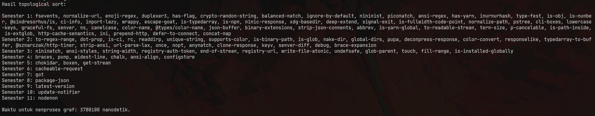

# 占い師 (Uranaishi)

**Peramal untuk membuat rekomendasi jurusan kuliah yang diambil, _dependency_
perangkat lunak yang harus diinstall, dan lain-lain.**

Aplikasi ini menggunakan algoritma _decrease and conquer_ untuk melakukan
_topological sort_. Faktor pengurangnya berubah-ubah (_decrease by variable
size_), hal ini dikarenakan pada setiap iterasi yang dikurangi dari graf adalah
sudut dengan derajat masuk bernilai 0. Kemudian, setelah graf dikurangi dari
sudut yang memliki derajat masuk 0, langkah-langkah _topological sort_ diulangi
untuk graf baru. Hal ini dilakukan sampai graf tidak memliki sudut.

## _Prerequisite_
* Java 15
> (Mungkin bisa di versi sebelumnya, tapi _developer_ membuat aplikasi
> ini di Java 15 jadi kompatibilitas di ersi lain tidak dijamin.)

## Instalasi
1. Unduh berkas `app.jar` di _releases_ _repository_ GitHub ini.
    1. Jika dibutuhkan, boleh diunduh juga `data.zip` untuk contoh berkas berisi
        graf.
1. Jalankan aplikasi dengan `java -jar app.jar`
    1. Untuk melihat perintah, gunakan `java -jar app.jar -h`

## Contoh
> Asumsi direktori data dan berkas app.jar ada di satu direktori yang sama

`./app -f data/grafTest7.txt`

## Author
Josep Marcello - 13519164
